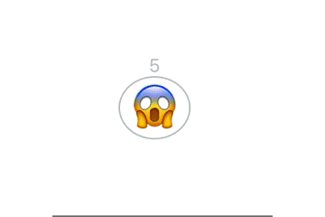

# react-emoji-animation-button

<h5 align="center"></h5>

<p align="center">
  <b><a align="center" href="https://kawa1214.github.io/react-emoji-animation-button/">See demo</a></b>
  </br>
  </br>
</p>

> A Emoji Animation Button.

[](https://www.npmjs.com/package/react-emoji-animation-button) [](https://standardjs.com)

## Install

```bash
npm install react-emoji-animation-button --save
```

## Usage

```jsx
import React from 'react'

import { EmojiAnimationButton } from 'react-emoji-animation-button'

export default () => {
  return 
    <EmojiAnimationButton
      text="😱"
      complete="👍"
      count={5}
      initClicked={false}
    />
}
```

## License

MIT © [kawa1214](https://github.com/kawa1214)
